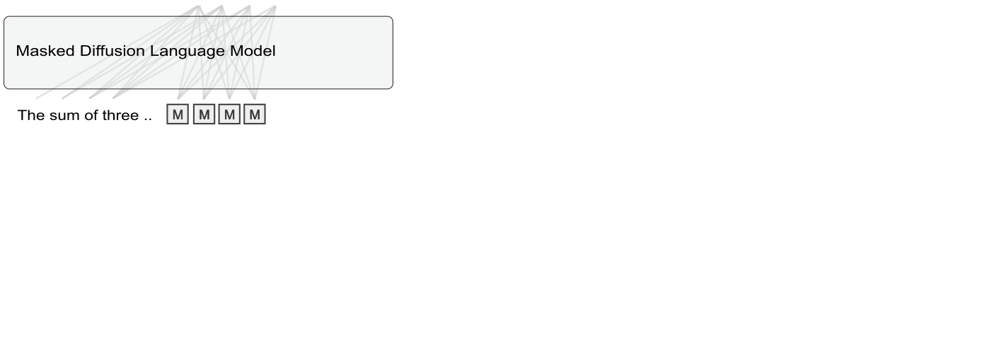

<div align="center">
<h1>Test-Time Scaling with Diffusion Language Models via
Reward-Guided Stitching</h1>

[Roy Miles](https://roymiles.github.io/)<sup>1</sup>, [Aysim Toker](https://scholar.google.com/citations?user=qq4LxBcAAAAJ&hl=en)<sup>1</sup>, [Andreea-Maria Oncescu](https://scholar.google.com/citations?user=V8fBl-0AAAAJ&hl=en)<sup>1</sup>, Songcen Xu<sup>1</sup>, [Jiankang Deng](https://jiankangdeng.github.io/)<sup>2</sup>, [Ismail Elezi](https://therevanchist.github.io/)<sup>1</sup>

<sup>1</sup> Huawei London Research Center, <sup>2</sup> MVP Lab

ArXiv Preprint (https://arxiv.org/pdf/2602.22871)

 

</div>

## Summary

Large language models benefit from generating multiple chains of thought, but existing aggregation methods operate at the trajectory level, discarding useful intermediate reasoning from partially correct attempts. We introduce Stitching Noisy Diffusion Thoughts, a self-consistency framework that reuses step-level reasoning from diverse diffusion-sampled trajectories. Given a problem, we (i) sample low-cost reasoning paths with a masked diffusion language model, (ii) score intermediate steps using a process reward model, and (iii) stitch the highest-quality steps into a composite rationale. An autoregressive solver then conditions on this rationale to produce the final answer. By separating exploration (diffusion) from evaluation and solution synthesis, our modular, training-free approach preserves broad search without relying on unified hybrid architectures. Across six math and coding benchmarks, our method improves average accuracy by up to 23.8%, with the largest gains on harder problems, while reducing latency by up to 1.8× compared to diffusion and unified baselines.

------------------------------------------------------------------------

## Repository Structure

    .
    ├── datasets/                  # Countdown test data (other evals auto-downloaded)
    ├── model/                     # LLaDA model class and configuration
    ├── eval/
    │   ├── run_eval.sh            # Entry point for generation (outputs saved to out/)
    │   ├── parse_and_get_acc.py   # Script for computing final accuracy
    ├── out/                       # Generated answers (created after running eval)
    ├── env.yaml                   # Conda environment file

------------------------------------------------------------------------

## Installation

Create the environment:

``` bash
conda env create -f env.yaml
conda activate diff_stitching
```

Install additional dependencies:

``` bash
pip install git+https://github.com/TIGER-AI-Lab/AceCoder
pip install evalplus
pip install math_verify
```

------------------------------------------------------------------------

## Generate Answers

Run evaluation from the `src/` directory:

``` bash
bash eval/run_eval.sh
```

Generated outputs will be saved in `out/`

------------------------------------------------------------------------

## Evaluate Answers

Edit the output path at the bottom of `eval/parse_and_get_acc.py`. Then run:

``` bash
python eval/parse_and_get_acc.py
```

------------------------------------------------------------------------

## Expected Results

Using the provided scripts and generation settings, you should obtain:

```
  Setup (task_model_genlen)                     Accuracy   Avg Steps
  --------------------------------------------- ---------- -----------
  gsm8k_GSAI-ML_LLaDA-8B-Instruct_512           91.81%     108.28
  math_GSAI-ML_LLaDA-8B-Instruct_512            55.00%     138.32
  humaneval_GSAI-ML_LLaDA-8B-Instruct_512       73.78%     447.37
  humanevalplus_GSAI-ML_LLaDA-8B-Instruct_512   70.12%     447.37
  mbpp_GSAI-ML_LLaDA-8B-Instruct_512            73.00%     188.68
  mbppplus_GSAI-ML_LLaDA-8B-Instruct_512        83.86%     176.65
```

------------------------------------------------------------------------

## Citation

``` bibtex
@misc{miles2026testtimescalingdiffusionlanguage,
      title={Test-Time Scaling with Diffusion Language Models via Reward-Guided Stitching}, 
      author={Roy Miles and Aysim Toker and Andreea-Maria Oncescu and Songcen Xu and Jiankang Deng and Ismail Elezi},
      year={2026},
      journal={arXiv preprint}
}
```

If you have any questions, feel free to email me!

Please consider citing our paper and staring the repo if you find this repo useful.